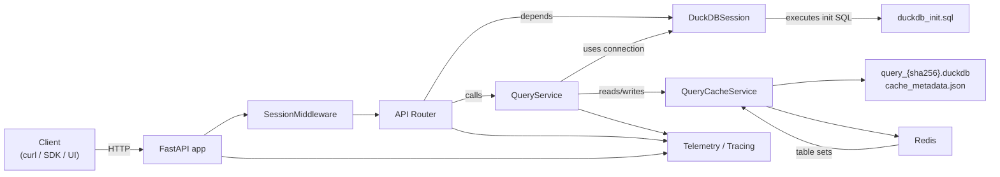
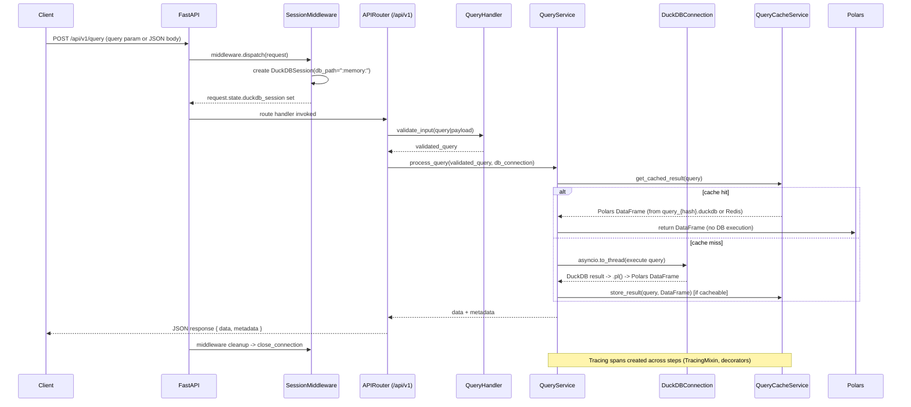
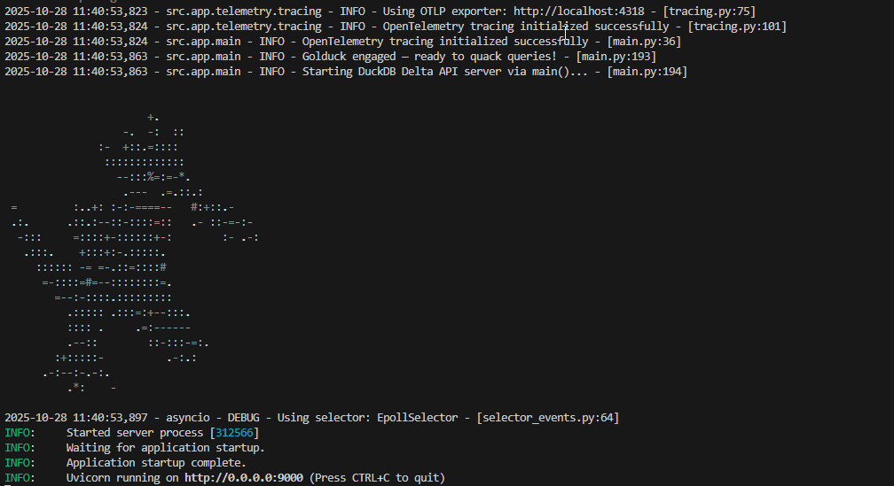

# DuckDB Delta API

This repository provides a small FastAPI service that exposes DuckDB-powered queries against Delta tables (via the Delta and UC Catalog extensions).

This README documents the current architecture, data flow, developer workflows, and important implementation conventions so contributors and automated agents can get productive quickly.

## High-level architecture

### Architecture overview
### Architecture (component flow)


### Key components

- FastAPI application (entry: `src/app/main.py`) with a root health endpoint and a single versioned API router mounted at `/api/v1` (`src/app/api/v1/routes.py`).
- Per-request DuckDB session: `SessionMiddleware` (`src/app/middleware/session_middleware.py`) creates a `DuckDBSession(db_path=":memory:")` and attaches it to `request.state.duckdb_session`. This ensures isolation between requests.
- Query execution: `QueryService` (`src/app/services/query_service.py`) accepts the DuckDB connection, runs blocking DuckDB calls inside `asyncio.to_thread`, converts results to Polars DataFrames (`result.pl()`), and returns them to the API layer.
- Caching layer: `QueryCacheService` (`src/app/services/query_cache_service.py`) optionally persists query results to per-query DuckDB files under `./query_cache` and maintains a `cache_metadata.json` file.
- Initialization/Extensions: `DuckDBSession` reads initialization SQL from a configurable source and substitutes environment placeholders (e.g. `${UC_CATALOG_TOKEN}`) before executing statements. By default, it uses the bundled `src/app/db/duckdb_init.sql` file, but you can provide a custom initialization file via the `duckdb_init_sql_file` environment variable. When SQL execution fails, a small fallback sequence installs/loads the `uc_catalog` and `delta` extensions. See [Database Initialization Configuration](docs/database-initialization.md) for detailed setup instructions.
- Telemetry: Tracing and lightweight logging helpers live in `src/app/telemetry/tracing.py`. The project uses OpenTelemetry with an OTLP exporter when available, otherwise it falls back to the console exporter. Helper mixins and decorators (e.g. `TracingMixin`, `@trace_async_function`) are used across services.

## Request / data flow (detailed)

### Data flow diagram



### Step-by-step request flow

1. Incoming HTTP request reaches FastAPI (`src/app/main.py`).
2. `SessionMiddleware` runs for each request:
   - Creates a new `DuckDBSession(db_path=":memory:")`.
   - Stores it in `request.state.duckdb_session`.
3. The API router (`/api/v1/query`) accepts queries either via `?query=...` or JSON body `{ "query": "..." }`.
4. The route handler uses `get_db_connection` to obtain a context manager from `DuckDBSession.get_connection()` and passes the connection to `QueryService`.
5. `QueryService.execute_query`:
   - Optionally checks cache via `QueryCacheService.get_cached_result(query)`.
   - If cache hit: loads data from that per-query DuckDB file, converts to Polars and returns.
   - On cache miss: executes the DuckDB query inside `asyncio.to_thread` to avoid blocking the event loop, converts results to Polars DataFrame, and — if eligible — stores the result using `QueryCacheService.store_result(query, df)`.
   - Caching decision uses `_should_cache_query()` — only SELECT-like deterministic queries are cached.
6. The API endpoint returns JSON: `{ "data": [...], "metadata": { ... } }` where metadata includes timing, row/column counts and whether the result came from cache.
7. After the response is sent, middleware cleans up the DuckDB session (connection close) ensuring no per-request state is reused.

## Important implementation conventions

- Per-request isolation: The default `db_path` passed into `DuckDBSession` is `:memory:`. To create persistent/shared DBs, change the `db_path` in `session_middleware.py`.
- Init SQL substitution: `DuckDBSession._substitute_env_variables` replaces placeholders in `duckdb_init.sql` with values from `src/app/config/settings.py` (loaded from `.env`). Keep secrets out of the repository.
- Cache file format & naming: cache files are DuckDB database files named `query_{sha256(normalized_query)}.duckdb` in `./query_cache` and metadata lives in `cache_metadata.json`.
- Long-running or blocking operations must be run off the event loop: see `QueryService` usage of `asyncio.to_thread`.
- Tracing: use `TracingMixin.log_and_trace(...)` and the provided decorators `trace_async_function`/`trace_function` to add spans. `init_tracing()` in `src/app/telemetry/tracing.py` auto-selects OTLP or Console exporter.

## Key files (quick map)

- `src/app/main.py` — app bootstrap, middleware, tracer init, top-level routes.
- `src/app/middleware/session_middleware.py` — per-request `DuckDBSession` creation and cleanup.
- `src/app/db/duckdb_session.py` — DuckDB connection lifecycle and `duckdb_init.sql` handling.
- `src/app/db/duckdb_init.sql` — SQL to install/load extensions, create secrets and attach UC catalog (uses env placeholders).
- `src/app/api/v1/routes.py` — API endpoints and request flow.
- `src/app/services/query_service.py` — query execution, conversion, caching decisions.
- `src/app/services/query_cache_service.py` — cache persistence, metadata, and cleanup.
- `src/app/config/settings.py` — pydantic-based settings (.env support).
- `src/app/telemetry/tracing.py` — tracing utilities and decorators used across the codebase.

## How to run (developer commands)


### Run Redis + Jaeger via Docker Compose

For local development you can start a sidecar Redis and Jaeger using Docker Compose. This repo includes a `docker-compose.yml` that launches Redis (for caching) and Jaeger (for traces):

```bash
docker compose up -d
```
### Run server (development):

```bash
uv sync
uv build
uv run golduck
```
This starts the FastAPI server at `http://localhost:9000` using the `golduck` console script entry point defined in `pyproject.toml`. The server displays colorful ASCII art on startup and includes comprehensive OpenTelemetry tracing.


Redis will be available at `redis://localhost:6379/0` and Jaeger UI at http://localhost:16686.

If you enable the Redis cache backend (see configuration below) the application will use Redis to store JSON-serialized query results and reuse them across requests.

Configuration: copy `.env.example` → `.env` and set values used by `src/app/config/settings.py`.

**Required environment variables:**
- `UC_CATALOG_TOKEN` — Unity Catalog authentication token (referenced by initialization SQL)
- `UC_CATALOG_ENDPOINT` — Unity Catalog endpoint URL

**Optional environment variables:**
- Azure credentials (`AZURE_TENANT_ID`, `AZURE_CLIENT_ID`, `AZURE_CLIENT_SECRET`) for Azure authentication
- `ADMIN_API_KEY` — required for `/api/v1/cache/clear_by_table` endpoint access
- `CACHE_BACKEND` — set to `redis` to enable Redis caching (requires Redis dependency)
- `OTEL_EXPORTER_OTLP_ENDPOINT` — set to `http://localhost:4317` to enable Jaeger tracing
- `DUCKDB_INIT_SQL_FILE` — path to custom database initialization SQL file (see [Database Initialization Configuration](docs/database-initialization.md))

To enable OpenTelemetry tracing with Jaeger, set the `OTEL_EXPORTER_OTLP_ENDPOINT` variable in your `.env` file to `http://localhost:4317`.

Note: tracing falls back to console exporter if the OTLP endpoint is unreachable.

## Cache & debugging tips

- Cache directory: `./query_cache` (files: `query_{hash}.duckdb`, metadata: `cache_metadata.json`).
- To inspect cache metadata: open `query_cache/cache_metadata.json`.
- If cache files appear corrupted, `QueryCacheService` will attempt to remove them when loading fails.
- If extension installation/loading fails, inspect your initialization SQL file (default: `src/app/db/duckdb_init.sql` or custom file set via `DUCKDB_INIT_SQL_FILE`) and supply required environment variables. The session initialization has a fallback sequence that runs `INSTALL`/`LOAD` commands programmatically. For custom configuration, see [Database Initialization Configuration](docs/database-initialization.md).
- ASCII Art: The server displays colorful ASCII art on startup using `scripts/render_ascii.py` to render `src/app/static/ascii_art.html`.

### Cache configuration options

This project  supports two cache backends. Configure via environment variables (or `.env`) which are read by `src/app/config/settings.py`.

- `CACHE_BACKEND` (default: `file`) — choose `file` to store per-query DuckDB files under `./query_cache`, or `redis` to store JSON results in Redis. **Note: Redis is a required dependency when using `redis` backend.**
- `REDIS_URL` (default: `redis://localhost:6379/0`) — connection URL used when `CACHE_BACKEND=redis`.
- `CACHE_EXPIRY_HOURS` — controls TTL for file-based cache expiration and defaults for Redis TTL when not explicitly set.
- `REDIS_CACHE_TTL_SECONDS` — optional override for Redis TTL (in seconds). If not set it defaults to `CACHE_EXPIRY_HOURS * 3600`.

Notes:
- In `redis` mode, cached results are stored as a JSON array of row objects under keys named `query:{sha256(normalized_query)}` and are set with an expiration TTL. The cache also stores metadata for each cached query under `query_meta:{hash}` and maintains per-table sets `table:{table_name}` that list query hashes referencing that table. This enables table-scoped invalidation using `/api/v1/cache/clear_by_table` when using the Redis backend.
- Expired entries in Redis are handled by Redis TTL semantics; `clear_expired_cache` is effectively a no-op for the Redis backend. `clear_all_cache` will remove keys matching the prefixes `query:*`, `query_meta:*`, and `table:*`.

### API Endpoints

The service provides these cache management endpoints:

- `GET /api/v1/cache/stats` — retrieve cache statistics and metadata
- `POST /api/v1/cache/clear?clear_type=all|expired` — clear cache entries globally
- `POST /api/v1/cache/clear_by_table` — clear cache entries that reference specific table names (requires admin API key)
- `GET /api/v1/cache/health` — check cache backend health status

Switch backends by updating your `.env` or environment variables and restarting the service.

## Contributing & changes

WIP

## License

MIT
